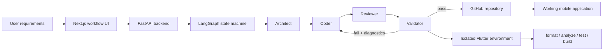
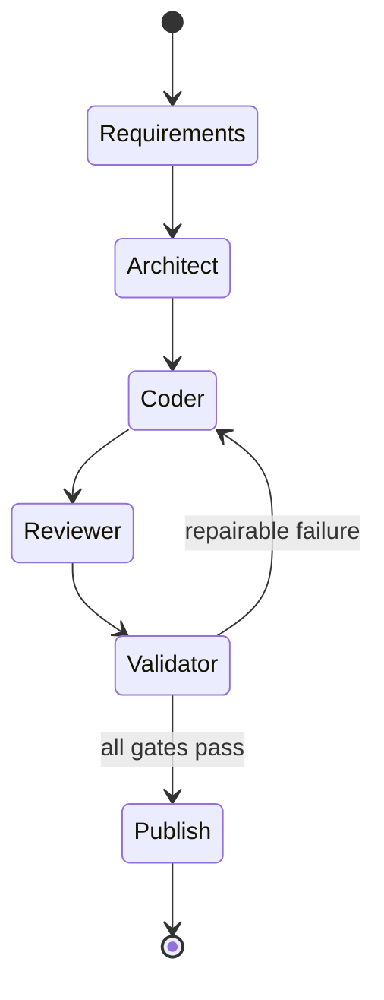
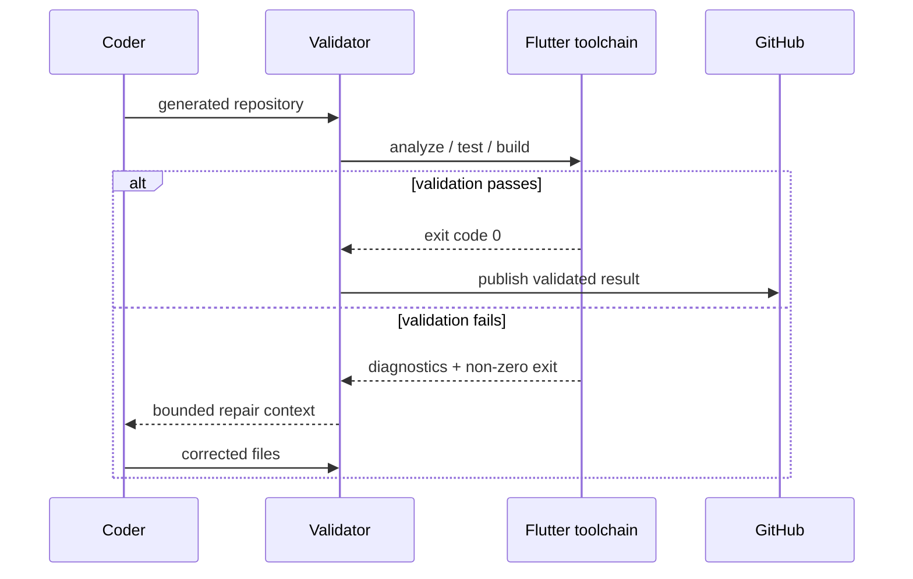

# ClawForge

> A multi-agent software engineering pipeline that turns product requirements into validated Flutter repositories.

ClawForge is an AI application builder designed around a simple principle: **generated code is not complete until deterministic tools prove that it can pass engineering gates**.

A user describes an application, target users, features and UI direction. A LangGraph workflow coordinates specialized agents for architecture, implementation, review and validation. The resulting Flutter project is written to GitHub and checked in an isolated Flutter environment before the workflow considers it complete.

This repository contains the full-stack platform around that pipeline: a Next.js interface, Supabase authentication, a FastAPI backend, LangGraph orchestration, GitHub integration and Docker-based Flutter validation.

## What makes ClawForge different

Many code-generation demos stop after an LLM emits files. ClawForge treats generation as only one stage in a controlled build loop:

```text
requirements
  -> architecture
  -> implementation
  -> review
  -> deterministic validation
  -> repair when needed
  -> GitHub repository
  -> installable application
```

The validator, not the language model, decides whether objective engineering checks pass.

## Architecture



## Agent workflow



### Architect

Transforms product intent into an implementation plan: screens, navigation, data models, state boundaries, dependencies and project structure.

### Coder

Generates and updates the repository files required to implement the plan.

### Reviewer

Inspects the generated code for consistency, missing pieces and engineering issues before deterministic validation.

### Validator

Runs objective checks in an isolated Flutter environment. Validation can include formatting, static analysis, tests and build/install checks. Failed diagnostics are routed back into the repair loop instead of being accepted because an LLM says the code looks correct.

## Why LangGraph

ClawForge is a workflow, not a single prompt chain. The graph needs explicit state, controlled transitions, conditional routing and bounded repair loops.

A graph model makes the following visible and testable:

- which agent owns each stage;
- what state moves between stages;
- what condition allows publication;
- what failure returns work to implementation;
- where retry limits belong;
- which operations are deterministic and which are model-driven.

A normal linear chain would make repair and validation control flow harder to reason about.

## State model

At a high level, workflow state carries:

```text
product requirements
architecture plan
file manifest
current generated files
review findings
validation results
repair history
GitHub repository target
workflow status
```

The important design rule is that agents do not receive unrestricted responsibility. Each stage works on the state and tools relevant to its job.

## Deterministic validation gates

A representative validation sequence is:

```text
1. materialize generated repository
2. start isolated Flutter environment
3. restore dependencies
4. run formatter checks
5. run static analysis
6. run tests
7. run build/install validation
8. collect stdout, stderr and exit codes
9. pass -> publish
10. fail -> return diagnostics to repair loop
```

This separation answers a core agent-engineering problem: **how do you prevent the model that wrote the code from grading its own work?**

## Failure and repair loop



A repair loop should be bounded. If the same class of failure persists or the maximum attempt count is reached, the workflow should terminate with diagnostics rather than looping indefinitely.

## GitHub as an execution artifact

GitHub is not only an export destination. Each generated repository is evidence of the pipeline's output:

- the file tree can be inspected;
- commit history records generated changes;
- the app can be cloned independently;
- Flutter tooling can validate it outside ClawForge;
- successful mobile installation provides end-to-end proof beyond a screenshot.

Generated repositories plus working installs on physical devices are strong validation evidence. The strongest public proof is a curated `docs/VALIDATED_APPS.md` page linking representative generated repositories, the validation gates each passed, and screenshots or device recordings.

## End-to-end flow

```text
User
  describes app idea, target users, features and UI direction

ClawForge
  creates structured requirements
  -> designs architecture
  -> generates repository files
  -> reviews implementation
  -> validates with Flutter tooling
  -> repairs failures when needed
  -> pushes the result to GitHub

Developer
  clones the generated repository
  -> runs or installs the application
```

## Platform stack

| Layer | Technology |
|---|---|
| Web application | Next.js, TypeScript |
| Authentication / project data | Supabase |
| API | FastAPI, Python |
| Orchestration | LangGraph |
| Model-driven engineering | specialized architecture, coding and review agents |
| Repository operations | GitHub API |
| Validation | Docker + Flutter toolchain |
| Monorepo | Turborepo |

## Repository layout

The project is organized as a monorepo with a web application and Python API. Use the actual source tree as the authority if paths change.

```text
.
├── apps/
│   ├── web/        # Next.js product interface
│   └── api/        # FastAPI + LangGraph workflow
├── docs/
│   ├── VALIDATED_APPS.md
│   └── AGENT_TRACE.md
└── ...
```

## Running ClawForge

### Requirements

- Node.js 18+
- Python 3.11+
- pnpm
- Docker
- Flutter validation image/toolchain
- model provider credentials
- GitHub credentials with only the repository permissions required by the workflow
- Supabase configuration when authentication/project persistence is enabled

### Development

The original project includes a detailed instruction manual. The common local flow is:

```bash
# web
cd apps/web
pnpm install
pnpm dev

# API
cd apps/api
uv sync
uv run uvicorn clawforge.main:app --reload --port 8000
```

Because this repository contains external integrations, copy example environment files and provide your own credentials. Never commit API keys or GitHub tokens.

## Validation evidence

The project has generated applications that have been run on physical mobile devices. Public evidence should be documented in [`docs/VALIDATED_APPS.md`](docs/VALIDATED_APPS.md) with links to representative generated repositories and the exact checks performed.

Recommended evidence for each app:

| Evidence | What it proves |
|---|---|
| Generated GitHub repository | files were materialized and persisted |
| `flutter analyze` output | static analysis gate |
| test output | behavioral checks |
| build artifact | toolchain acceptance |
| physical-device screenshot/video | application actually runs |
| trace ID / workflow summary | connection to ClawForge generation run |

## Example agent trace

A useful trace should show the entire engineering loop, not only model text:

```text
USER REQUIREMENTS
  -> ARCHITECT OUTPUT
  -> FILE MANIFEST
  -> CODER TOOL CALLS
  -> REVIEW FINDINGS
  -> VALIDATOR COMMANDS + EXIT CODES
  -> REPAIR DIFF, if required
  -> FINAL GITHUB REPOSITORY
  -> APP RUNNING ON DEVICE
```

Use [`docs/AGENT_TRACE.md`](docs/AGENT_TRACE.md) to capture one real generation run.

## Testing strategy

ClawForge should be tested at three levels:

### Workflow tests

- state transitions;
- pass/fail routing;
- retry limits;
- terminal failure behavior;
- state preservation between nodes.

### Tool/integration tests

- GitHub repository operations;
- generated file writes;
- validator command execution;
- timeout handling;
- malformed model output.

### End-to-end validation

- generate a small known application;
- run all Flutter gates;
- push to a test repository;
- install/run on an emulator or physical device.

## CI roadmap

A strong CI pipeline for this repository should run:

```text
web lint/typecheck
Python lint/tests
LangGraph workflow tests
secret scanning
Docker build validation
small fixture-based generation test
```

The full model-driven end-to-end generation test should be optional or scheduled because it depends on external APIs and can be slow or costly.

## Security model

ClawForge handles powerful credentials and code-writing tools. The security boundary should remain explicit:

- request the minimum GitHub permissions required;
- never expose tokens to model context;
- scope repository tools to the selected target;
- validate paths before file writes;
- isolate generated code during execution;
- apply time and resource limits to validation;
- redact secrets from logs and diagnostics;
- cap repair attempts.

## Current limitations

- model output can still require multiple repair iterations;
- deterministic validation proves toolchain checks, not product quality;
- generated UI quality depends on requirement specificity and model capability;
- full end-to-end runs depend on external model services;
- physical-device validation is currently documented manually rather than through a device farm.

## Roadmap

- [ ] Publish a curated gallery of validated generated applications
- [ ] Add a real end-to-end trace with validator output and repair history
- [ ] Add screenshots/videos from physical-device runs
- [ ] Add workflow transition tests and retry-bound tests
- [ ] Add CI for web, API and fixture-based validator checks
- [ ] Add structured tracing for every agent node and tool call
- [ ] Add evaluation metrics: first-pass success rate, repair count and validation duration
- [ ] Add sandbox resource limits and stronger secret redaction

## Engineering questions this project can answer

**Why not use a single agent?** Because architecture, implementation, review and deterministic validation have different responsibilities and failure modes.

**Why not let the LLM decide whether code is correct?** Because formatter, analyzer, tests and build tools provide objective signals the model cannot replace.

**Why Docker?** To make validation reproducible and isolate generated code from the orchestration service.

**How do you prevent infinite repair loops?** Conditional graph edges plus explicit attempt limits and terminal failure states.

**What is the proof that generated apps work?** Generated repositories, successful Flutter validation, and applications running on physical devices.

## Engineering summary

ClawForge is not a prompt-to-code demo. It is a controlled agentic software engineering workflow where specialized model-driven stages are constrained by deterministic validation and produce independently inspectable GitHub repositories.

## License

Add a license before external distribution or reuse.